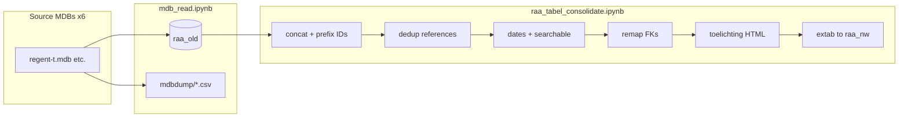

# RAA Conversion Code Review Report

Audit of the merge pipeline from six MS Access period databases to MySQL `raa_nw`. See [CONVERSION_NOTES.md](CONVERSION_NOTES.md) for day-to-day operational reference.

## Scope

1. [mdb_read.ipynb](../mdb_read.ipynb) — MDB → MySQL `raa_old` + CSV dumps
2. [raa_tabel_consolidate.ipynb](../raa_tabel_consolidate.ipynb) — merge, transform, export
3. [data_definitions.py](../data_definitions.py), [help_functions.py](../help_functions.py)
4. Reference dump: [result_sql_db/raa_dump20240829.sql](../result_sql_db/raa_dump20240829.sql)

**Preservation principle:** The notebook-first design is appropriate. Improvements harden logic without discarding the existing flow.

---

## Part 1: Final output fields NOT in source MDBs

### 1.1 Intentional derivations

| Output field | Mechanism |
|---|---|
| All `id` / `*_id` | Sequential IDs after concat + dedup |
| `searchable` | `tussenvoegsel` + `geslachtsnaam` |
| `heerlijkheid` | `Heerlijkheid` + `" en "` + `Heerlijkheid2` |
| ISO dates | `makedate_from_givendate()` |
| Period flags | `map_dict()` + `pmap` on prefixed `old_*` IDs |
| `toelichting` | External HTML + concordance JSON |
| Bataafs-Franse URL | `makelink()` when HTML empty |

### 1.2 Derived fields that alter source meaning

| Behavior | Risk |
|---|---|
| Missing month/day padded to 01-01 or 12-31 | Invented precision |
| `?` in year → 0 or 9 | Changes uncertainty |
| Default year 1000 | Invented century |
| `mark_for_delete` | Editorial flag for divperioden rows |

### 1.3 Period flags

`republiek_friezen` maps to the same value as `republiek` (both `2`). No separate column in export.

---

## Part 2: Source data missing from final output

### 2.1 Tables not exported

`Gewest`, `BronFunctieDetails`, `Data`, `RegentOud`, staging tables, and `functiebovenlokaal` / `functielokaal` (processed internally only).

### 2.2 Columns dropped

- `OnbepaaldGeboortedatum` / `OnbepaaldOverlijdensdatum` — now restored in `columnmaps` (re-export required)
- `geboortedatum_als_bekend` / `overlijdensdatum_als_bekend` — now restored in `columnmaps`
- `Functie.Periode`, `Functie.Lokaal`, `College.Periode` — lost on name-only dedup
- All `old_*` columns — intentional

### 2.3 Relational gaps (Aug 2024 dump)

| Issue | Severity |
|---|---|
| `bron_details.persoon_id` missing | High — fixed in `columnmaps` |
| `alias.persoon_id` partial nulls | Medium |
| `searchable` vs `searchable_geslachtsnaam` | Low — naming mismatch |

### 2.4 Cross-period persons

Same person in two periods → two `persoon_id` values. Concordance notebooks are QA only.

---

## Part 3: Bugs found

### 3.1 Corrupted toelichting URLs (Aug 2024 dump)

Some `instelling.toelichting` values contain a full pandas Series repr instead of a URL. Current `makelink()` uses per-row `.apply()` — re-export and run `validate_export.py`.

### 3.2 Logic bugs (status)

| Issue | Status |
|---|---|
| `tbl.drop_duplicates()` no-op | Fixed (`inplace=True`) |
| `persoon[cols].drop_duplicates` on subset | Replaced with documented no-op |
| `columnmaps` `regent_id` vs `persoon_id` | Fixed |
| concordance swapped birth/death columns | Fixed |
| Plaintext `connection.json` | Gitignored; use `connection.json.example` |

---

## Part 4: Improvements applied

1. Git-tracked docs (`docs/`), `validate_export.py`, `connection.json.example`
2. `columnmaps` fixes for `persoon_id` and date metadata
3. Dedup bug fixes in consolidate notebook
4. Remaining manual step: **re-run** `raa_tabel_consolidate.ipynb` and validate

### Not yet implemented (future)

- Extract notebook logic to `consolidate_steps.py`
- Export `Gewest` / `BronFunctieDetails` if needed
- Preserve `Functie.Periode` / `Lokaal` on dedup
- Rename `searchable` → `searchable_geslachtsnaam`

---

## Part 5: Recommended verification checklist

- [ ] Re-run full pipeline from fresh MDBs
- [ ] `python validate_export.py`
- [ ] Assert `bron_details.persoon_id` &lt;5% null
- [ ] Assert no `toelichting` contains `dtype: object`
- [ ] Sample 20 persons: `geboortedatum` vs source parts
- [ ] Confirm `mark_for_delete` behavior in web app

---

## Summary

| Area | Status |
|---|---|
| Architecture | Sound |
| Reference merge | Works |
| Person merge | By design per-period; not cross-merged |
| Export fidelity | Improved; re-export needed |
| Maintainability | Improved with docs + validation |

**Bottom line:** Preserve the conversion code. Re-export after `columnmaps` fixes, then run `validate_export.py`.
